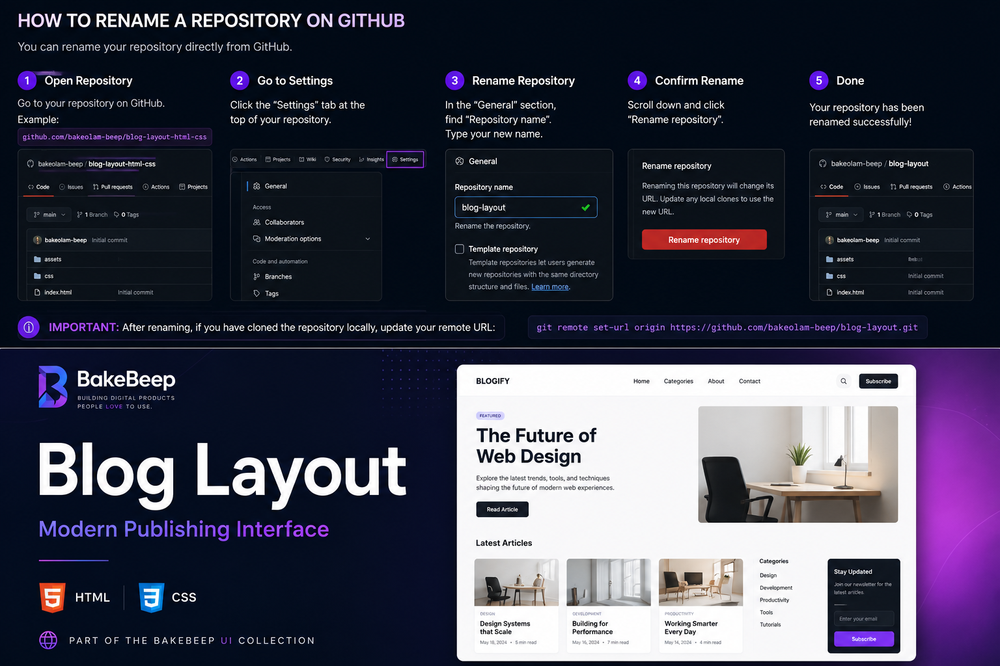
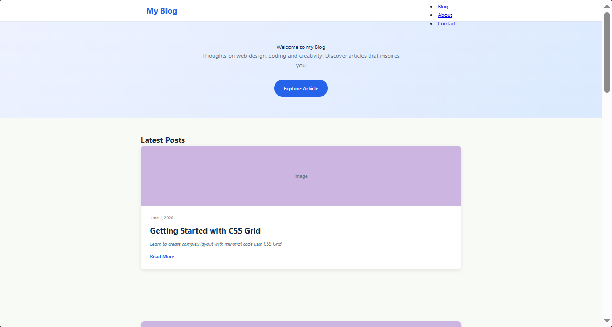

# Blog Layout

> A responsive publishing homepage built with HTML and CSS.




> **BakeBeep UI Collection**

This project is part of the **BakeBeep UI Collection**—a growing library of modern, reusable interface components and frontend patterns designed with performance, accessibility, and maintainability in mind.

---

## Overview

Blog Layout is a modern publishing homepage that demonstrates responsive layouts, clean typography, and scalable content organization using semantic HTML and CSS.

The project focuses on creating a reading experience that feels familiar, fast, and adaptable across desktop, tablet, and mobile devices.

---

## Features

- Responsive navigation
- Hero section
- Featured articles
- Two-column post grid
- Reusable content cards
- Footer
- Mobile-first layout
- Semantic HTML
- Modern typography
- Responsive spacing

---

## Preview

### Desktop



### Mobile


---

## Design Philosophy

The layout emphasizes readability, whitespace, and visual hierarchy. Every section has a clear purpose, making the design suitable as a foundation for blogs, magazines, newsletters, and publishing platforms.

---

## Technologies

- HTML5
- CSS3
- CSS Grid
- Flexbox
- Custom Properties
- Media Queries

---

## Folder Structure

```text
blog-layout/
│
├── assets/
├── css/
├── index.html
└── README.md
```

---

## Future Improvements

- Dark mode
- Search functionality
- Article filtering
- Category pages
- Reading progress bar
- CMS integration
- RSS support
- Accessibility enhancements

---

## Live Demo

🔗 (https://blog-layout-blue.vercel.app/)

---

## License

MIT License.

---

## About BakeBeep

BakeBeep is a software studio building modern web interfaces, reusable UI systems, and developer-focused digital products.

Every repository reflects our commitment to clean engineering, thoughtful design, accessibility, and continuous improvement.

Explore the rest of the BakeBeep UI Collection on our GitHub profile.